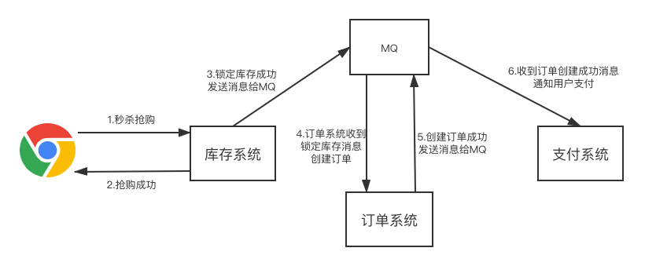

# 快速了解RabbitMQ 

## RabbitMQ是什么？

RabbitMQ 是当前热门的消息队列中间件之一。

## RabbitMQ主要特点

根据定义（Message Queue）可知它是个具有**先进先出**特点的消息存储中间件，可以理解为存储消息的容器。生产者只需将消息放入该容器中，而无需关心消费者如何处理消息。同时消息可以由多个生产者存入中间件，也可以由多个消费者去获取并处理。同时生产者并不知道消费者何时处理消息，因此它还具有异步的特性。

总结一下主要特点：

- 阻塞&有序：通过先进先出维护一个阻塞的有序队列
- 中间件容器：在分布式环境下使用，用于多应用间通信
- 异步：生产者将消息丢入容器即可，不再关心消费者何时处理

## 使用RabbitMQ主要目的

通过上述特点，便可以理解MQ常见的使用目的：

- **解耦：**维护了生产者-> 中间件  和 中间件->消费者的关系，让生产者和消费者没有直接的调用关系，仅需关心各自的发/收的数据结构即可，达到程序解耦的目的。
- **削峰：**当生产者收到大量请求时，生产消息丢给mq无需立即处理(立刻响应，慢慢处理)。且可以增加消费者数量，来分摊处理生产者生产的的消息。通过异步和负载均衡分流思路，来解决生产者需要及时处理大量请求的问题，以达到削峰的目的。

### 解耦例子：

如果某个功能需要A  B  C 三个步骤，并且得依次执行，并且 A B C 都要执行很久。正常情况下，我们需要判断A是否执行完，然后执行B，接着判断B是否执行完，然后再执行C。

如果用了MQ，那么A只需要立刻返回，告诉用户请求成功，处理完成后丢一个消息给MQ，那么B就可以根据MQ中消息执行下一步，同样，B执行完发送处理结果给MQ就行，C自然能拿到消息并继续执行自己的业务处理。如果中途B失败了，C自然不会收到消息，也就不会执行了。这样B不需要关心A是否成功，C也不需要关心B是否成功，只要判断MQ是否有消息，消息数据是否满足业务需要即可。

由于RabbitMQ 还具备有序、消息通信等特点，因此还可以用来解决一些业务处理顺序的问题，也可以作为分布式环境的数据传输/存储中间件，但是这么用的话，就会显得比较"骚"了，因为想要使用这些特点时候，都有更好的中间件产品可以选择。因此在使用MQ或者其他技术的时候，都应该尽量避免这种"骚操作"，当然特殊问题特殊看待，在一些特定场景下能解决问题，"骚一下"也是情有可原的。

说到这可能会存在一些疑问：

- 如果是阻塞队列，我为什么不用Java自带的BlockingQueue？为什么要用RabbitMQ？

- 如果是为了异步，我为什么不直接`new Thread(()->{}).start()`？

- 如果是为了通信，为什么不直接使用Http的工具，直接发HTTP请求？

这些疑问都没错。如果只是为了通过阻塞队列控制代码执行顺序，用BlockingQueue，这当然没问题，也最简单。

如果在单一场景下，仅仅为了异步，且系统本身不存在性能瓶颈，使用线程/线程池也没有任何问题。

如果仅仅为了通信，发一个json  字符串 或者其它字节流等信息，也确实没有必要引入RabbitMQ增加复杂度。

因此，我们使用mq 除了上述的解耦，削峰等主要目的外，还为了使用它异步，阻塞，通信，存储消息，灵活的生产/消费规则，而这些特点想要同时使用，让消息实现方便的网络传输、可靠的存储、灵活的投递，那我们用MQ自然是更合适，而不需要自己大量编码来维护消息队列的这些特性。

## RabbitMQ使用场景

上面分析了那么多概念，现在你能知道什么时候使用mq了吗？

下面举一个常见的场景方便大家理解：

系统需要做秒杀活动，当用户抢购商品时需要锁定库存，扣库存，生成订单。

如果立即处理这么多操作，系统肯定会很慢，而且请求量巨大的话，系统就会面临崩溃风险。这时候我们可以通过如下流程立即响应用户：

1. 在秒杀的系统中通过特定机制告诉用户抢购成功，
2. 将锁定库存消息发送到MQ，库存系统进行锁定和扣库存的操作，然后发送消息到MQ。
3. 订单系统发现扣库存操作成功，进行订单创建操作，完成后发送消息到MQ

这里，用户在发起请求后，立刻就能知道自己是否抢购成功。我们通过引入MQ，将锁库存，生成订单，通知用户支付等流程异步执行。减少了大量用户请求时的压力。同时，可以通过增加库存系统，订单系统，支付系统来增加后续业务的处理能力。

## 使用RabbitMQ缺点

上面其实已经提到了一些MQ的缺点:

- 如果系统简单，引入mq会增加系统复杂度
- 由于mq独立部署，在网络不稳定情况下，增加了系统故障的风险，因为业务流程依赖mq进行通信协作，一旦mq无法连接，将导致系统无法正常处理业务。

